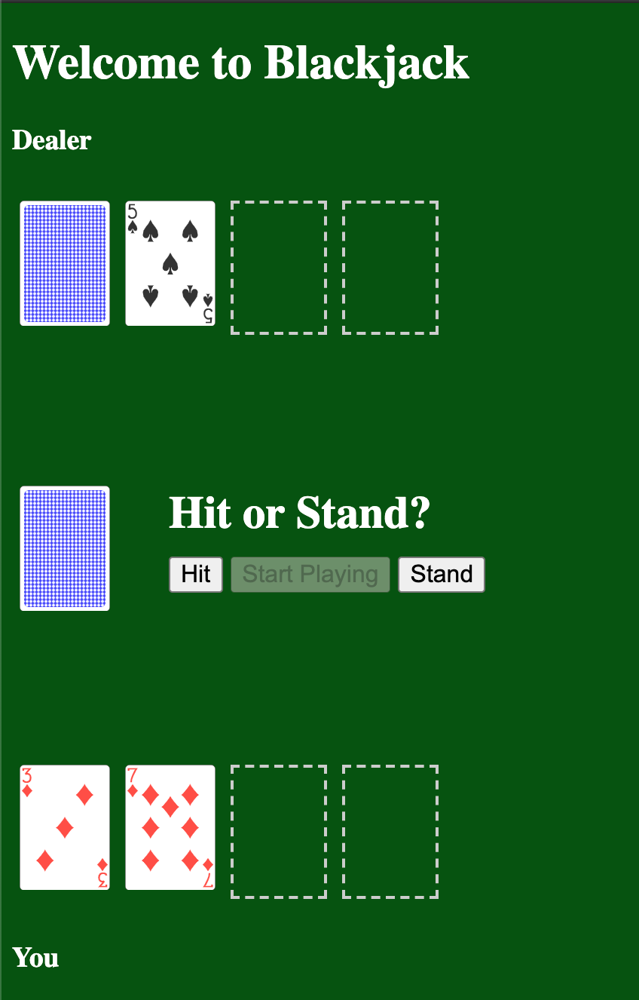

<h1>Blackjack Game App</h1>

After three weeks of intensive lectures in HTML/CSS/JS, I took a shot at combining these three technologies into building a simple game such as Blackjack.

 

You can play the game at this link: https://daniele-frade.github.io/blackjack-game/

 

<h3>Technologies used:</h3>
 
<ul>
    <li>HTML</li>
    <li>CSS</li>
    <li>Javascript</li>
</ul>

 

<h3>Third part dependencies:</h3>
 
Javascript library for displaying playing cards as images: https://github.com/cardmeister/cardmeister.github.io

 
 

<h3>Features:</h3>
 
<ul>
<li>Start the game</li>
<li>Hit or stand</li>
<li>Check and display winner</li>
<li>Play again</li>
</ul>

 

