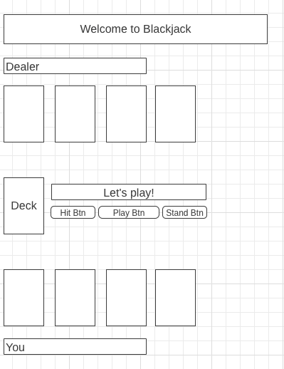

<h1>Blackjack Game App</h1>

<h3>Goals:</h3>

Implementing Blackjack game with Vanilla Javascript + HTML/CSS

 

<h3>Link:</h3>

https://daniele-frade.github.io/blackjack-game/

 

<h3>Coding languages:</h3>

<ul>
    <li>HTML</li>
    <li>CSS</li>
    <li>Javascript</li>
    <li>External Javascript library for cards elements: https://github.com/cardmeister/cardmeister.github.io</li>
</ul>

 

<h3>Features:</h3>

<ul>
<li>Start the game</li>
<li>Hit or stand</li>
<li>Check and display winner</li>
<li>Play again</li>
</ul>

 

<h3>Wireframe:</h3>

